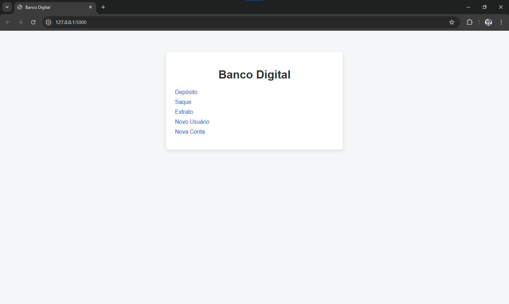

# 💳 Banco Digital Web

Sistema bancário desenvolvido com **Python + Flask**, aplicando separação de responsabilidades entre regra de negócio e interface web.



Este projeto começou como aplicação de terminal e foi evoluído para uma aplicação web completa.

---

## 🚀 Funcionalidades

- ✅ Cadastro de usuário  
- ✅ Criação de conta bancária  
- ✅ Depósito com validação  
- ✅ Saque com limite por operação  
- ✅ Controle de limite diário de saques  
- ✅ Extrato de movimentações  
- ✅ Interface web estilizada com CSS  

---

## 🏗️ Estrutura do Projeto


banco-web/
│
├── app.py
├── models.py
│
├── templates/
│ ├── index.html
│ ├── deposito.html
│ ├── saque.html
│ ├── extrato.html
│ ├── novo_usuario.html
│ └── nova_conta.html
│
└── static/
└── css/
└── style.css


---

## 🧠 Arquitetura

O projeto segue o princípio de separação de responsabilidades:

- `models.py` → Regras de negócio  
- `app.py` → Rotas e controle da aplicação (Flask)  
- `templates/` → Interface HTML  
- `static/` → Arquivos estáticos (CSS)  

---

## 🛠️ Tecnologias Utilizadas

- Python 3
- Flask
- HTML5
- CSS3
- Jinja2

---

## ⚙️ Como Executar o Projeto

### 1️⃣ Clonar o repositório

```bash
git clone https://github.com/seu-usuario/banco-web.git
```

2️⃣ Acessar a pasta

```
cd banco-web
```

3️⃣ Criar ambiente virtual (opcional)

```
python -m venv venv
```


### Ativar no Windows:

```
venv\Scripts\activate
```

4️⃣ Instalar dependências

```
pip install flask
```

5️⃣ Executar a aplicação

```
python app.py
```

6️⃣ Acessar no navegador

```
http://127.0.0.1:5000
```

## 📌 Regras de Negócio

Limite máximo de saque: R$ 500,00

Limite diário de saques: 3 operações

Não permite saque com saldo insuficiente

Não permite valores negativos para depósito ou saque

Não permite criar usuário com CPF duplicado

Não permite criar conta sem usuário existente

## 📈 Evolução do Projeto

Projeto originalmente desenvolvido como aplicação CLI (terminal) durante bootcamp, evoluído para:

Aplicação Web

Interface gráfica

Estrutura modular

Código reutilizável

## 🎯 Objetivo

Praticar:

Backend com Flask

Organização de código

Transformação de sistema CLI em Web

Estruturação de projeto para portfólio

## 🔮 Melhorias Futuras

Persistência com SQLite

Sistema de login por usuário

Deploy em cloud (Render / Railway)

Autenticação e sessões

Dashboard administrativo

## 👨‍💻 Autor

Desenvolvido por Ernand